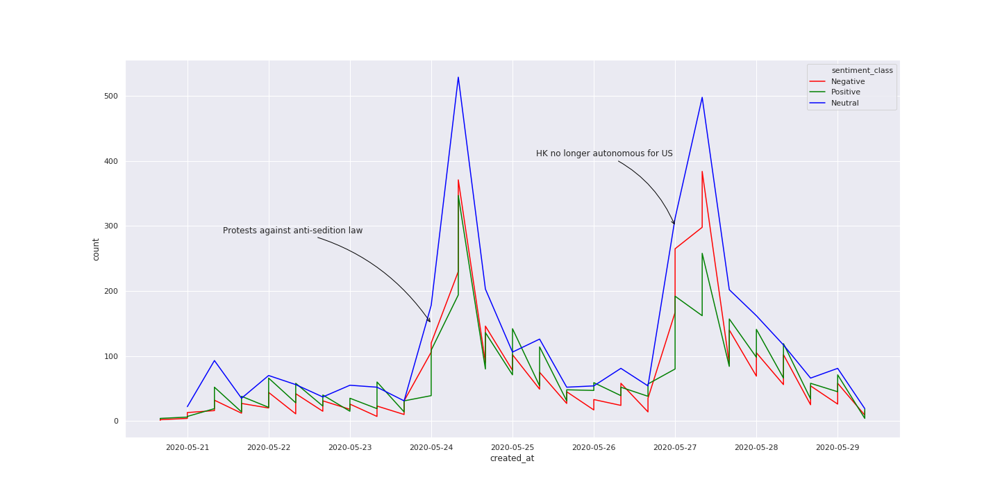
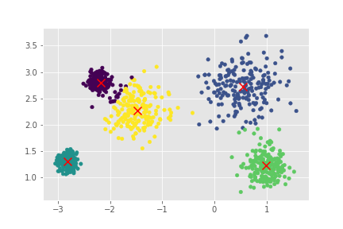
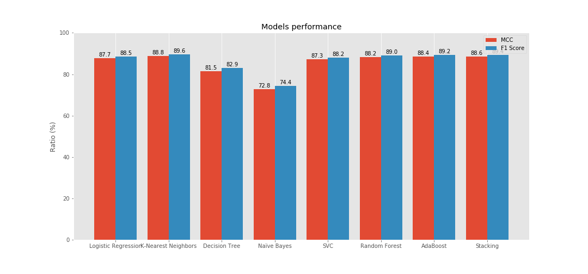
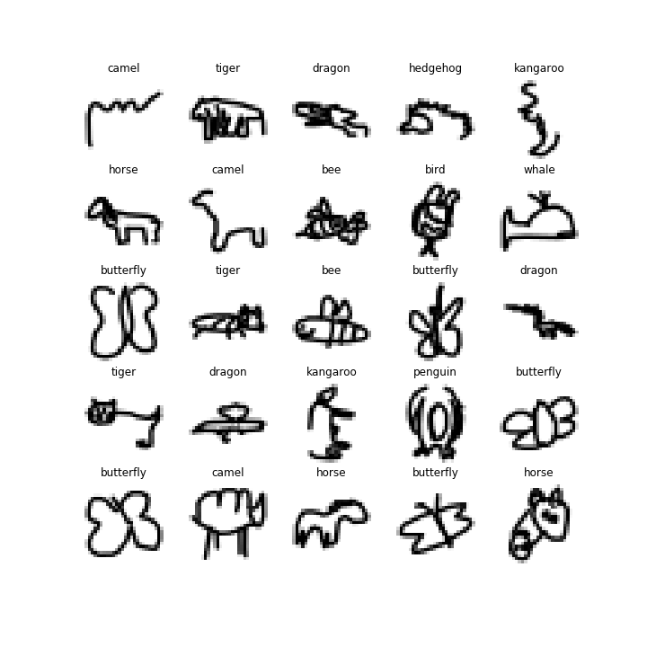
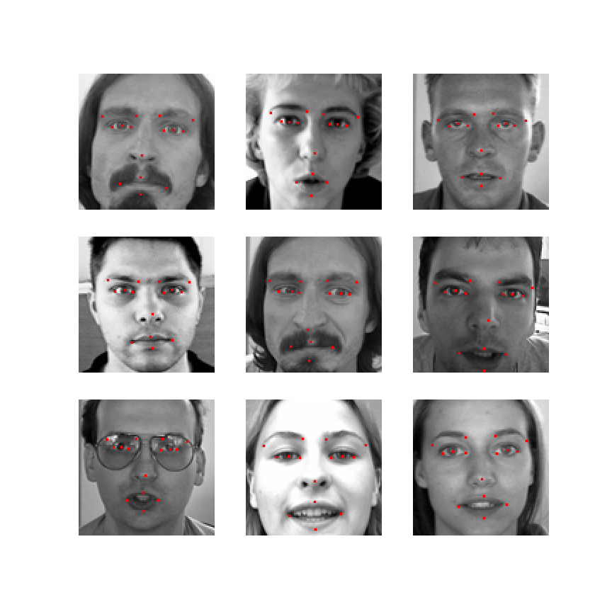

# Data Science Portfolio
 
A repository of the projects I worked on or currently working on. It is updated regularly. Click on the projects' titles to see the full analysis and code.

For a more pleasant experience for browsing the portfolio and for reading my articles, check out [thomasdelatte.com](https://thomasdelatte.com).

Please contact me on [Linkedin](https://www.linkedin.com/in/thomasdelatte) if you are looking to hire a data scientist.

---
 
## Stand-alone Projects

### [GPT-2 EU text Generator](https://github.com/thomasdelatte/gpt2-eu-acts)
* [The OpenAI GPT-2](https://github.com/openai/gpt-2) uses a transformer-based language model to write impressively coherent and passionate essays. Using [GPT2-simple](https://github.com/minimaxir/gpt-2-simple), I fine-tuned the model on all [__European Union's__ Directives, Regulations and Decisions](https://github.com/iliaschalkidis/lmtc-eurlex57k) to get generated new EU legislative acts. 
* I then put the model in a Docker container and depolyed it with Google Cloud Run.
* The generated texts are surpisingly coherent and can produce some quirky use of legalese.
* You can read more about the process and the results in my [article on my blog](thomasdelatte.com/gpt2-eu-generator).
* You can generate some text [here](https://thomasdelatte.com/app).

---

### [Baudelaire Poem Generator](https://github.com/thomasdelatte/baudelaire-poem-generator)
* I scraped all 181 Baudelaire's poems from [poesie-francaise.fr](https://www.poesie-francaise.fr/poemes-charles-baudelaire/) using BeautifulSoup.
* Inspired by the [famous Karpathy's article](http://karpathy.github.io/2015/05/21/rnn-effectiveness/), I used a charRNN model with Tensorflow 2 and Keras to generate Baudelaire-like poems.
---

## Micro Projects

### [Sentiment Analysis on HK Protests Tweets](https://github.com/ThomasDelatte/Notebooks/blob/master/twitter-sentiment-analysis.ipynb)
* I scraped 45,000 tweets with Tweepy and preprocessed them.
* Word cloud, sentiment analysis with NLTK and exploratory analysis of the data.

---

### [Clustering with K-means](https://github.com/ThomasDelatte/Notebooks/blob/master/Clustering_with_K-Means.ipynb)
* A visual introduction and  to the K-Means algorithm. 
* For a more visually pleasing experience, you can find my article [here](https://thomasdelatte.com/2020/04/kmeans/).

---

### [Pulsars Detection with HTRU2 Dataset](https://github.com/ThomasDelatte/Notebooks/blob/master/Pulsars_HTRU2.ipynb)
* The HTRU2 Pulsars dataset contains data about pulsars. I first use the dataset as a binary classification problem, and as an opportunity to try different classification algorithms and compare their performance.
* Then, I use the dataset for unsupervised learning tasks, namely by using a clustering method (K-Means) with PCA as a precursor step.

---

### [Animals from the QuickDraw Dataset](https://github.com/ThomasDelatte/Notebooks/blob/master/QuickDraw_Animals.ipynb)
* The QuickDraw dataset contains 50 millions of drawings collected by Google.
* I select 12 categories from the dataset (only animals) and train this dataset on a CNN.

---

### [Facial Keypoints Detection (Kaggle)](https://github.com/ThomasDelatte/Notebooks/blob/master/Facial_Keypoints_Recognition.ipynb)
* The data comes from a Kaggle competition. 
* I train a CNN to recognize 15 keypoints on faces.

--- 

### [House Prices (Kaggle)](https://github.com/ThomasDelatte/Notebooks/blob/master/House_Prices_Kaggle.ipynb)
* This Kaggle competition is a regression problem: we predict the price of houses based on more than 80 features (and many missing values). This gives us interesting possibilities for feature transformation and data visualization.

--- 